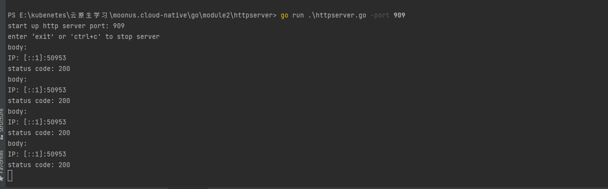
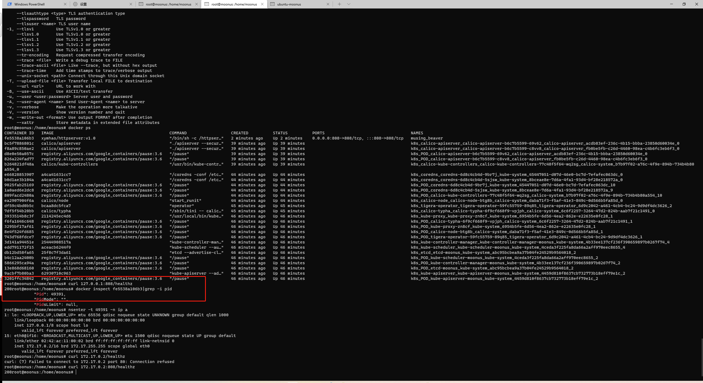

1. 接收客户端 request，并将 request 中带的 header 写入 response header
2. 读取当前系统的环境变量中的 VERSION 配置，并写入 response header
3. Server 端记录访问日志包括客户端 IP，HTTP 返回码，输出到 server 端的标准输出
4. 当访问 localhost/healthz 时，应返回 200

###step1 通过 port指定启动的端口
```
go run httpserver.go -port 909
```
默认端口909

###step2 浏览器打开http://localhost:909/healthz
默认返回200

打开F12， network 查看response header

###step3 控制台输出


### module 3 practice

[Docker Image]( https://hub.docker.com/repository/docker/xymhao/httpserver)

#### Practice
